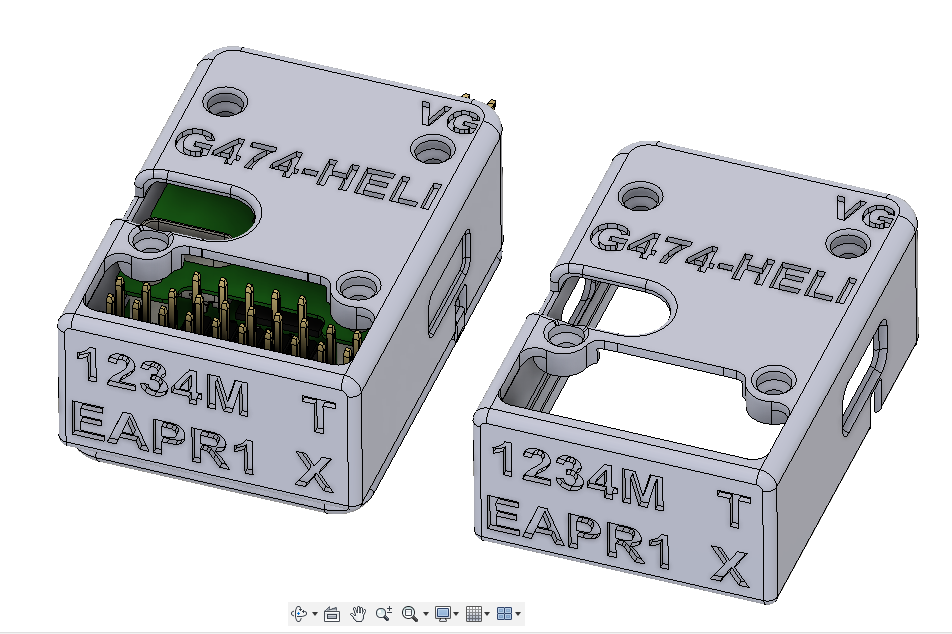
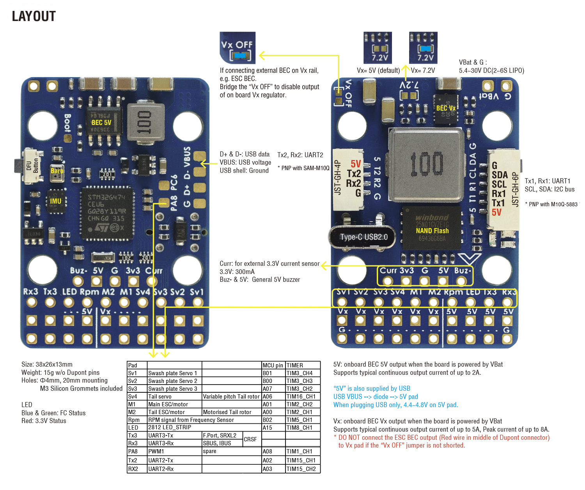

# MATEKSYS-G474-HELI-housing-
MATEKSYS-G474-HELI Housing Box  3D Print files 

Box for Mateksys G474-Heli rotorflight board

Created to protect my board.
images/Box mateksys G474-HELI v9.jpg

All files are free, the sale of these stls is strictly prohibited.

The design made in fusion360 is under development, new versions may be added as soon as I understand that I should change the design or add options.

Requests for changes can be made, I accept user moods of course.

Rotorflight Firmware
https://www.rotorflight.org/docs/Tutorial-Quickstart/Introduction

Mateksys RC HELICOPTER FLYBARLESS CONTROLLER G474-HELI
https://www.mateksys.com/?portfolio=g474-heli#tab-id-4

read me in development
